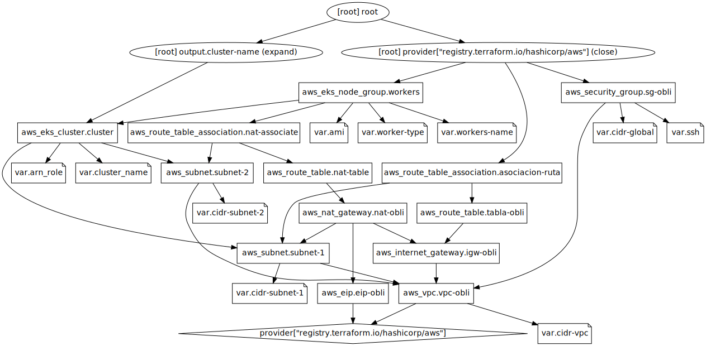

# Obligatorio implementacion de soluciones cloud


## Disclaimer

Este proyecto solo funcionara en sistemas operativos linux.

Por lo tanto si es usuario de windows se recomienda el uso de WSL 
o 
una maquina virtual con una distro de linux instalada.

se debe instalar docker y kubectl previamente antes de ejecutar los scripts sino fallara

La cli de aws en caso de no tenerla el script requirements.sh lo instalara por usted

Tambien esta aplicacion es solo una prueba de la potencia de los microservicios pero no cuenta con redundancia que tendria una aplicacion en produccion

# Integrantes

Guillermo Ferradas (270809)

Mauricio Campodonico (212382)

## Este repositorio contiene las siguentes carpetas:

| Nombre    | descripcion                                                                                                                                  |
|-----------|----------------------------------------------------------------------------------------------------------------------------------------------|
| Terraform | Se encuentran los archivos terraform que se usaran  para hacer la infraestrucutra en aws                                                     |
| Manifests | Donde se encuentran los manifiestos de kubernetes para el deploy de los servicios                                                            |
| src       | En este directorio se encuentran las imagenes de docker que se usaran para la consturccion de las imagenes  que se usaran en los manifiestos |


# Infraestructura creada


Este sera el resultado que se logra cuando se usa el script infra.sh

Este es el arbol de dependencias de los archivos de terraform




# Como uso el repositorio?

Se debe primero ejecutar el script requirements.sh

Este script se asegurara que el ambiente este correctamente seteado para levantar la aplicacion
(ejecutar el script con permisos de sudo o ser root)

- Instalar kubectl y docker verificar su instalacion
   En caso de no saber como instalar verificar aqui:
   - https://docs.docker.com/engine/install/
   - https://kubernetes.io/docs/tasks/tools/

- Clonar el repositorio mediante git clone 

- en caso de no tener permisos de ejecucion dar permisos mediante chmod

- ejecutar requirements.sh

 Este paso puede demorar ya que el script construye y pushea imagenes a un repositorio publico en docker hub.

 ```
find $HOME/Obli-ISC/src -maxdepth 2 -type d -exec sh -c 'cd "{}" && docker build -t "gferradas/$(basename {}):v2" . && docker push "gferradas/$(basename {}):v2"' \;
```
Este pedazo de codigo es el encargado de recorrer la carpeta src en donde se encuentran los archivos
necesarios para construir las imagenes y pushearlas

- Luego de seguir los pasos que pide el requirements.sh ejecutar el script llamado infra.sh
    - Este script es el encargado de construir la infraestructura en aws mediante terraform 
      se debe dar yes al momento de que se le pida  
    - se configurara el acceso al cluster mediante kubectl 
    - se haran los deployments 1 a 1 dentro de la carpeta manifests
    - aparecera la url a la aplicacion una vez todo este desplegado donde puede acceder al frontend

Una vez tengas la url deberia ver la siguiente pagina:


en la cual podra interactuar y generar compras de prueba:


\_Y listo ya tendrias una aplicacion corriendo con microservicios corriendo en Kubernetes!!!!!!!!!!!!!!\_