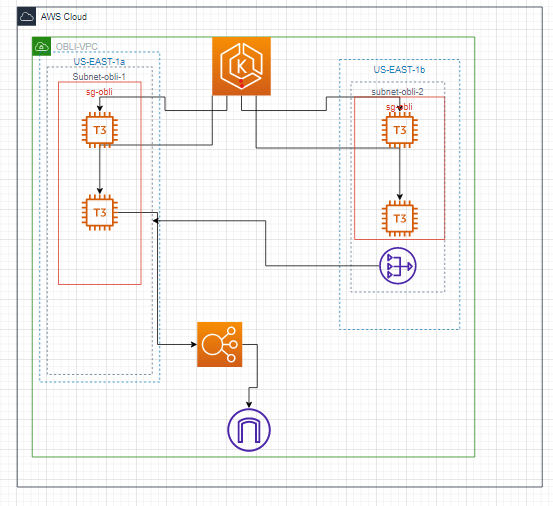
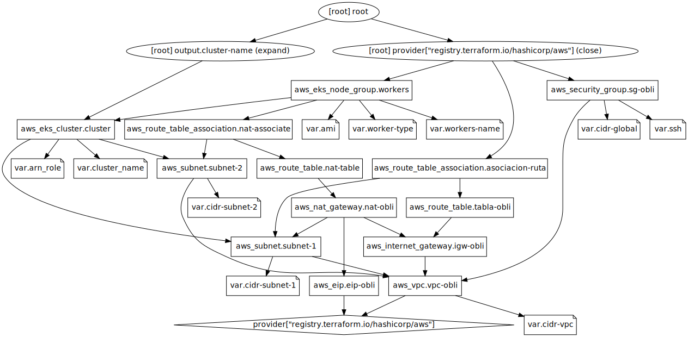
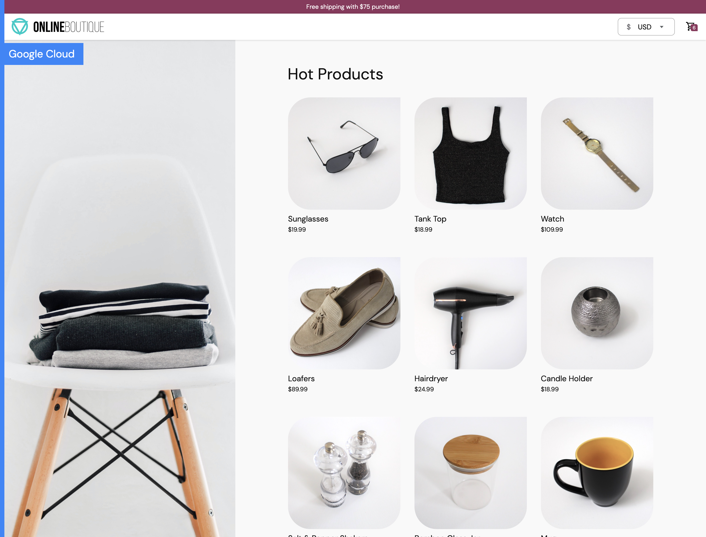
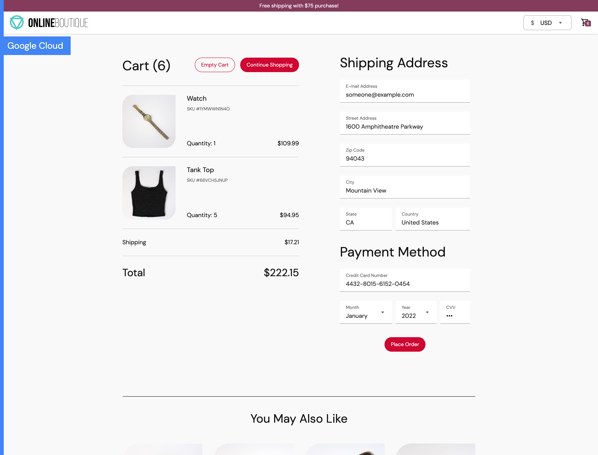

# Obligatorio implementacion de soluciones cloud

# Integrantes

Guillermo Ferradas (270809)

Mauricio Campodonico (212382)


## Disclaimer

Este proyecto solo funcionara en sistemas operativos linux.

Por lo tanto si es usuario de windows se recomienda el uso de WSL 
o una maquina virtual con una distro de linux instalada.

EL equipo debe tener instalado docker y kubectl previamente antes de ejecutar los scripts sino fallara

La cli de aws en caso de no tenerla el script requirements.sh lo instalara por usted

Este repositorio es un repositorio meramente instructivo y educativo por lo tanto los componentes de la aplicacion no son redundantes en caso de querer modificar y agregar redundancia a los componentes se debe investigar previamente como podemos dar redundancia.

en caso de querer acceder por ssh a los workers se debera cambiar el nombre de la key "vockey" por el que usted tenga en el codigo de terrafom cluster.tf 

```
 remote_access {
    ec2_ssh_key = "vockey"
  }
  ```
en las linea 17 se encuentra el mismo
Mas adelante se habla de posibles mejoras que se puede hacer para dar redundancia a la aplicacion.

## Este repositorio contiene las siguentes carpetas:

| Nombre    | descripcion                                                                                                                                  |
|-----------|----------------------------------------------------------------------------------------------------------------------------------------------|
| Terraform | Se encuentran los archivos terraform que se usaran  para hacer la infraestrucutra en aws                                                     |
| Manifests | Donde se encuentran los manifiestos de kubernetes para el deploy de los servicios                                                            |
| src       | En este directorio se encuentran las imagenes de docker que se usaran para la consturccion de las imagenes  que se usaran en los manifiestos |


# Infraestructura creada



Este sera el resultado que se logra cuando se usa el script infra.sh




Este es el arbol de dependencias de los archivos de terraform

para cumplir con el arbol de dependencias usted debe crear un archivo llamado variables.tfvars donde pondra el valor de las variables que se definen.

Este seria un ejemplo:
```
touch variables.tfvars

vim/vi/nano variables.tfvars

cluster_name = "obli-cluster"
worker-type = "t3.large"
cidr-subnet-1 = "172.0.0.0/24"
cidr-vpc = "172.0.0.0/16"
cidr-subnet-2 = "172.0.1.0/24"
ssh = 22
workers-name = "obli-workers"
ami = "AL2_x86_64"
cidr-global = "0.0.0.0/0"

```
puede cambiar los valores a su gusto experimentando con distintos valores.

# Como uso el repositorio?

Se debe primero ejecutar el script requirements.sh

Este script se asegurara que el ambiente este correctamente seteado para levantar la aplicacion
(ejecutar el script con permisos de sudo o ser root)

- Instalar kubectl y docker verificar su instalacion
   En caso de no saber como instalar verificar aqui:
   - https://docs.docker.com/engine/install/
   - https://kubernetes.io/docs/tasks/tools/

- Clonar el repositorio mediante git clone 

- en caso de que los archivos requirements.sh y infra.sh no tengan permisos de ejecucion darselos mediante el comando chmod

```
chmod +x requirements.sh

chmod +x infra.sh
```

- ejecutar requirements.sh

Para ejecutar el script se hace de la siguiente manera:
```
./requirements.sh
```
 Este paso puede demorar ya que el script construye y pushea imagenes a un repositorio publico en docker hub.

 ```
find $HOME/Obli-ISC/src -maxdepth 2 -type d -exec sh -c 'cd "{}" && docker build -t "gferradas/$(basename {}):v2" . && docker push "gferradas/$(basename {}):v2"' \;
```

Este pedazo de codigo es el encargado de recorrer la carpeta src en donde se encuentran los archivos
necesarios para construir las imagenes y pushearlas

- Luego de seguir los pasos que pide el requirements.sh ejecutar el script llamado infra.sh
    - Este script es el encargado de construir la infraestructura en aws mediante terraform 
      se debe dar yes al momento de que se le pida  
    - se configurara el acceso al cluster mediante kubectl 
    - se haran los deployments 1 a 1 dentro de la carpeta manifests
    - aparecera la url a la aplicacion una vez todo este desplegado donde puede acceder al frontend

Una vez tengas la url deberia ver la siguiente pagina:



Esto puede demorar ya que el elastic load balancer que genera el manifiesto del frontend demora un poco en quedar activo

en la cual podra interactuar y generar compras de prueba:



Podras verificar los pods con el comando

```
kubectl get pods
```
vera que tendra 10 pods corriendo que son los 10 microservicios 

tambien podra ver los service que se crean mediante los manifiestos con el comando

```
kubectl get svc all
```
y podra verificar que aparece la url que se muestra tambien aparece ahi ya que de ahi se saca 


# Posibles mejoras

En esta seccion se ven mejoras que se le puede hacer a distintos componentes para obtener redundancia y alta disponibilidad para la aplicacion.

| Componente      | Mejora                                                                                                                                                                                                                                                                                                                                                                                                        |
|-----------------|---------------------------------------------------------------------------------------------------------------------------------------------------------------------------------------------------------------------------------------------------------------------------------------------------------------------------------------------------------------------------------------------------------------|
| Redis           | Para mejorar redis hay 2 opciones sacarlo de kubernetes para sacarlo se puede usar el servicio de aws ElastiCache. Si optamos por esta parte se debe modificar el manifiesto del cart, para que en vez de apuntar al nombre de servicio de redis apunte a la url que te da aws de elasticache.                                                                                                                |
| Pods (no redis) | Aunque ya hay redundancia en los pods por los livenessProbe y readinessProbe que el pod al ser detectado no sano sera cambiado por otro pod aunque esto causara un poco de indisponibilidad. Para esto se pueden agregar mas replicas mediante un replicaset para que genere mas pods por microservicio para a la hora de que un pod sea dado de baja por defectuoso no haya una ventana de indisponibilidad  |
| Manifiestos     | Para mejorar los manifiestos en terminos de automatizacion y que agarren la imagen y tag de forma  automatizada es generar un templatefile de terraform para lograr lo comentado anteriormente.                                                                                                                                                                                                               |